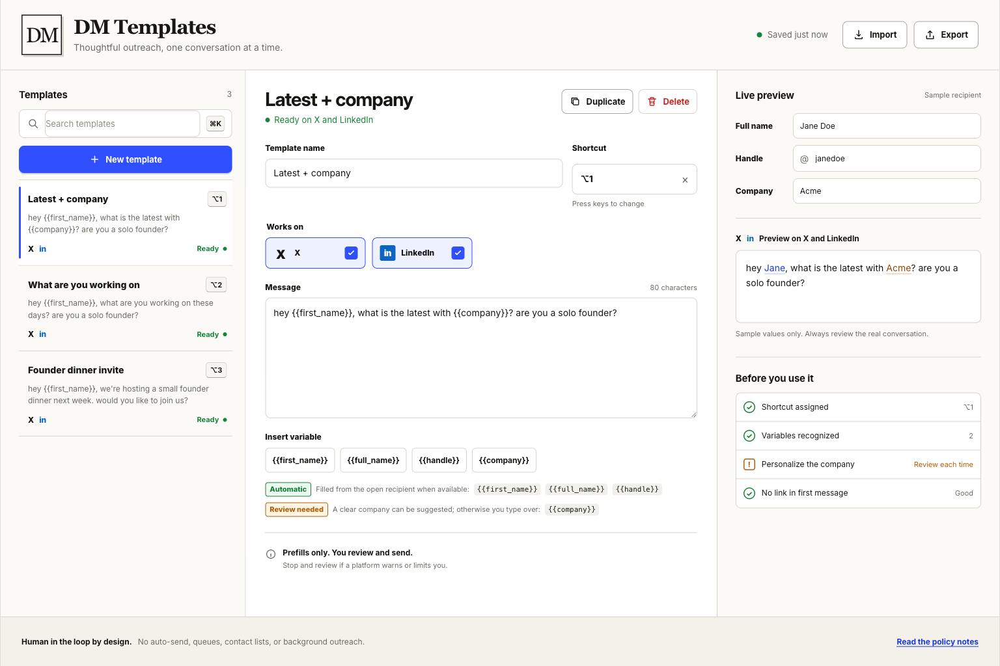

# DM Templates for X and LinkedIn

A Manifest V3 Chrome extension for thoughtful, shortcut-driven messages. It prepares one draft in the conversation you already opened, then leaves the review and Send action to you.

No build step. No runtime dependencies. No hosted backend. Templates sync through `chrome.storage.sync` in your browser.



## Why this exists

Most outreach software is built to increase volume. This extension is built to reduce repeated typing without removing judgment.

The operating loop is deliberately small:

1. Open one X or LinkedIn conversation, or a LinkedIn connection note.
2. Press a shortcut for the right template.
3. Review the resolved recipient details and personalize the draft.
4. Press Send yourself.

There is no AI, campaign builder, recipient list, queue, scheduler, or auto-send path.

## What the workbench does

- **Organizes reusable messages.** Search, create, duplicate, edit, and delete templates from one focused workspace.
- **Targets the right platform.** A template can work on X, LinkedIn, or both. Shortcut conflicts only count when platform targets overlap.
- **Records real keyboard shortcuts.** The editor catches reserved and duplicate combinations before they fail in a conversation.
- **Previews recipient data.** Edit the sample name, handle, and company to see exactly how a message resolves.
- **Surfaces message risks.** Readiness checks flag unknown variables, company placeholders, links in first messages, missing shortcuts, and conflicts.
- **Keeps the library portable.** Export a JSON backup and restore it through a confirmation-based import flow.
- **Syncs through Chrome.** Templates live in `chrome.storage.sync`; no account or hosted service is required.

## Template variables

| Variable | X | LinkedIn | Behavior |
| --- | --- | --- | --- |
| `{{first_name}}` | Conversation header | Conversation or open member profile | Filled automatically |
| `{{full_name}}` | Conversation header | Conversation or open member profile | Filled automatically |
| `{{handle}}` | X handle | Public `/in/` profile identifier | Fails closed when unavailable |
| `{{company}}` | Explicit public bio signal | Clear signal already visible on the open page | Suggested when confidence is high; otherwise inserts a selected `[company]` placeholder |

Names are cleaned programmatically. Emoji and decorative suffixes are removed, all-caps first names are normalized, and LinkedIn unread-count badges or connection-degree tokens are rejected.

Company resolution is intentionally conservative:

- On X, the extension accepts explicit signals such as `Founder @WorkOS`, `CEO of Acme Labs`, or `Building Modal`. If the open conversation does not expose the bio, the existing X-only path can briefly open that recipient's public profile in an inactive tab, read the description metadata, and close it.
- On LinkedIn, the extension uses only the conversation or member profile already open. It can inspect a visible top-card company, one current Experience entry, profile-title metadata, or a clear headline. It never opens another LinkedIn profile in the background.

Ambiguous or missing data never becomes a guess. Automatic variables stop insertion with an explanation; `{{company}}` falls back to a selected value that must be reviewed.

## Requirements

- Google Chrome or another Chromium browser that supports Manifest V3 extensions
- [Node.js](https://nodejs.org/) 18+ only if you want to run the local test suite

## Environment variables

None. The extension does not read `.env` files or call external APIs with credentials. Do not commit secrets into this repository.

## Install locally

1. Clone this repository.
2. Open `chrome://extensions`.
3. Enable **Developer mode**.
4. Choose **Load unpacked** and select the repository folder.
5. Click the extension icon to open the template workbench.

After changing local code, click **Reload** on the extension card and refresh any existing X or LinkedIn tabs. Content scripts already loaded in a tab do not update themselves.

## Use it

1. Create or select a template in the workbench.
2. Choose X, LinkedIn, or both under **Works on**.
3. Insert supported variables and assign a shortcut. The starters use `⌥1`, `⌥2`, and `⌥3` on macOS.
4. Check the live preview and the **Before you use it** list.
5. Open a one-to-one conversation, or open **Add a note** from a LinkedIn member profile.
6. Press the shortcut, personalize the inserted text, and send only when it is right for that person.

Group conversations fail closed. A LinkedIn surface without a usable profile link can still resolve name variables, but a template that explicitly needs `{{handle}}` will not insert.

## Safety boundary

The extension may fill the composer that is already open. It must never:

- click or trigger Send;
- schedule, queue, or batch messages;
- open or iterate through conversations;
- build contact lists or scrape search results;
- act while the user is away;
- work around a platform warning, restriction, or recipient preference.

Read [SAFETY.md](SAFETY.md) for the full operating guardrails and the separate policy considerations for X and LinkedIn. LinkedIn's written restrictions on browser add-ons are broader, so account-policy risk is not zero even with this narrow interaction model.

## Architecture

The extension has no build step and no runtime dependencies. Platform behavior stays isolated so changes to LinkedIn do not silently alter X.

| Path | Responsibility |
| --- | --- |
| `manifest.json` | Manifest V3 permissions, content scripts, and options entry point |
| `src/background.js` | Opens the workbench, seeds starter templates, and serves the bounded X-only public-profile lookup |
| `src/options.*` | Responsive template library, editor, live preview, readiness checks, and backup flows |
| `src/template-lib.js` | Pure variable, shortcut, platform-targeting, and diagnostic helpers |
| `src/dm-templates.js` | X and XChat composer adapter |
| `src/linkedin-dm-templates.js` | LinkedIn conversation and connection-note adapter |
| `src/linkedin-lib.js` | Pure LinkedIn recipient and visible-profile parsing |
| `src/content.js` | Platform-neutral utility runner |
| `src/content.css` | Injected feedback styles, all prefixed with `ufx-` |
| `icons/` | Source artwork and generated toolbar icons for the unpacked extension |
| `test/` | Node regressions plus local browser harnesses for the real content-script stacks |

To add another utility, create `src/<utility>.js`, register `{ id, label, run() }` on `window.__ufxUtilities`, and load it before `src/content.js` in the relevant manifest entry. Each utility runs inside its own error boundary.

## Validate

Run the complete regression suite:

```sh
for file in src/*.js test/*.js; do node --check "$file"; done
node --test test/*.test.js
git diff --check
```

Render the production options markup with deterministic local data:

```sh
python3 -m http.server 4173
open http://127.0.0.1:4173/test/options-harness.html
```

The X, LinkedIn message, LinkedIn connection-note, and Draft.js harnesses exercise their production script stacks against local DOM fixtures. None of them can trigger Send.

For live selector debugging, switch DevTools to the extension's JavaScript context and run `__ufxDmDebug()` on X or `__ufxLinkedInDmDebug()` on LinkedIn. Both sites change their DOM regularly, so a passing local harness is not proof that the current live interface still matches.

CI runs the same syntax check and `node --test` suite on pull requests and pushes to `main`.

## License

No `LICENSE` file is included yet. Before redistributing or treating this as open source with clear terms, choose a license (for example MIT, Apache-2.0, or a source-available option) and add a root `LICENSE` file. Until then, default copyright rules apply.
